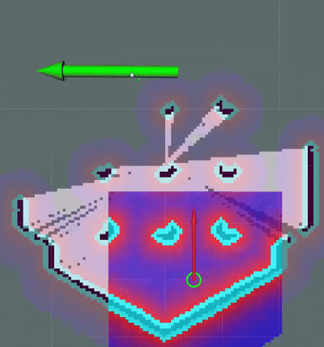

# Minimal Nav Stack

A lightweight ROS 2 navigation stack built from scratch as a personal learning project, inspired by [Nav2](https://nav2.ros.org/).
This project focuses on understanding, implementing and experimenting with path planning and motion planning algorithms under real-world constraints.

---



---

## Overview

This project implements a minimal but fully functional navigation stack comprising three core components:

- **Costmap** — Built using Euclidean Distance Transform (EDT) for efficient obstacle inflation and smooth cost gradients.
- **Planner** — Hybrid A\* for kinematically feasible path planning that respects vehicle constraints.
- **Controller** — Regulated Pure Pursuit for smooth, speed-adaptive path tracking.

## Results

- Achieved navigation speeds of up to **1.0 m/s** in TurtleBot3 simulation.
- Hybrid A\* planner benchmarked across maps ranging from **200×200 to 600×400** cells, consistently achieving planning times of **< 100 ms**

## Parameters

```yaml
navigation:
  ros__parameters:
    global_costmap:
      frequency: 1
      inflation_radius: 0.55
      inscribed_radius: 0.11
      scaling_factor: 3.0

    local_costmap:
      frequency: 5
      window_size: 3.0
      inflation_radius: 1.0
      inscribed_radius: 0.11
      scaling_factor: 3.0

    collision_checker:
      robot_radius: 0.12

    planner:
      frequency: 10
      max_linear_velocity: 1.0
      max_angular_velocity: 2.0
      angular_resolution: 5.0
      angular_tolerance: 0.2
      distance_tolerance: 0.2
      analytical_expansion_ratio: 3.5
      analytical_expansion_max_length: 3.0
      steering_penalty: 0.8
      change_steering_penalty: 0.3
      reverse_penalty: 2.0
      cost_penalty: 12.0
      expansion_cost: 200.0
      path_length_weight: 0.985
      max_explore_iterations: 50000
      motion_model: "DUBINS"
      optimizer:
        iterations: 1000
        smooth_weight: 0.3
        data_weight: 0.2

    controller:
      frequency: 10
      max_linear_velocity: 1.0
      max_angular_velocity: 2.0
      max_linear_acceleration: 0.8
      max_angular_acceleration: 2.3
      sim_time: 1.0
      lookahead_distance: 0.6
      lookahead_gain: 1.5
      max_lookahead_distance: 0.9
      min_lookahead_distance: 0.3
      proximity_distance: 0.3
      proximity_heuristic_scale: 1.0
      approach_velocity_scaling_dist: 1.0
      min_approach_linear_velocity: 0.05
      min_heading_angle_error: 0.785
      distance_tolerance: 0.1
```

## References

### Papers

Dubins, L. E. (1957). *On curves of minimal length with a constraint on average curvature, and with prescribed initial and terminal positions and tangents.* American Journal of Mathematics, 79(3), 497–516.
https://www.jstor.org/stable/2372560


Reeds, J. A., & Shepp, L. A. (1990). *Optimal paths for a car that goes both forwards and backwards.* Pacific Journal of Mathematics, 145(2), 367–393.
https://projecteuclid.org/euclid.pjm/1102645450


Dolgov, D., Thrun, S., Montemerlo, M., & Diebel, J. (2008). *Practical search techniques in path planning for autonomous driving.*
https://ai.stanford.edu/~ddolgov/papers/dolgov_gpp_stair08.pdf


Felzenszwalb, P. F., & Huttenlocher, D. P. (2012). *Distance Transforms of Sampled Functions.* Theory of Computing, 8(1), 415–428.
https://cs.brown.edu/people/pfelzens/papers/dt-final.pdf


Macenski, S., Singh, S., Martín, F., & Ginés, J. (2023). *Regulated Pure Pursuit for Robot Path Tracking.* Autonomous Robots (Springer).
https://arxiv.org/abs/2305.20026


Ohnishi, F., & Takahashi, M. (2026). *Dynamic Window Pure Pursuit Considering Velocity and Acceleration Constraints.*
https://arxiv.org/abs/2601.15006

---

### Code

Reeds-Shepp curves: adapted from nathanlct/reeds-shepp-curves (MIT License)
https://github.com/nathanlct/reeds-shepp-curves

---
